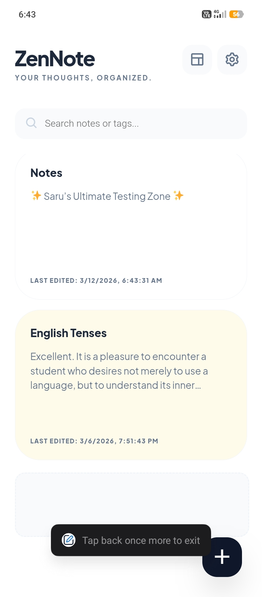
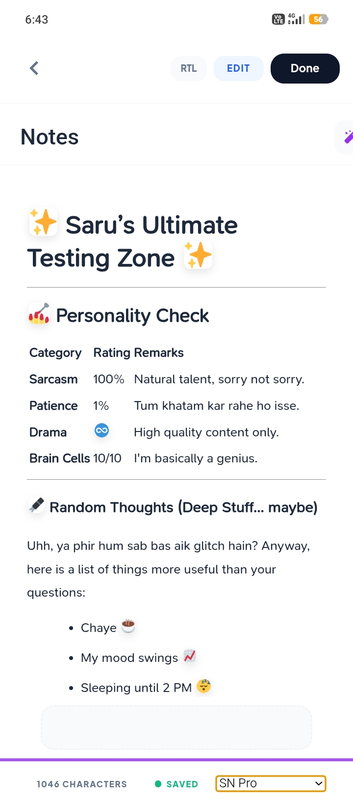
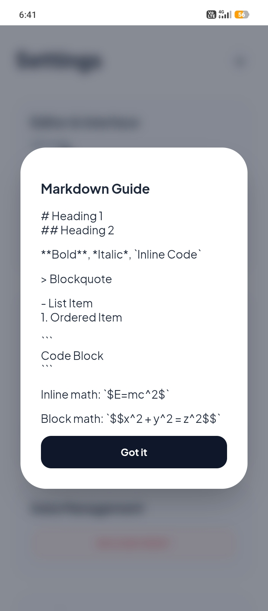
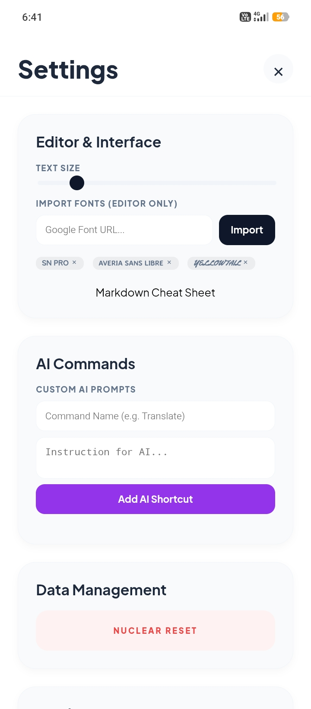
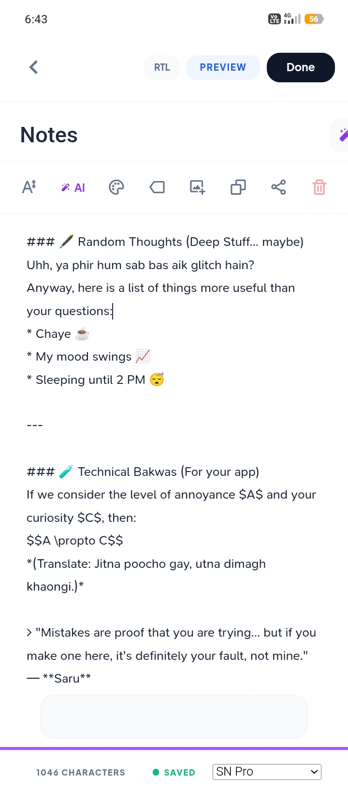

# 🌿 ZenNote
**Your Thoughts, Organized. Minimalist. Intelligent.**

ZenNote is a high-performance Markdown note-taking suite designed for power users who refuse to compromise on aesthetics. It bridges the gap between a simple scratchpad and a full-scale IDE for thought, featuring a "pixel-perfect" UI and a modular AI core.

---

## 📸 Interface Preview
| **Main Dashboard** | **Rich Preview Mode** | **Editor & LaTeX** |
|---|---|---|
|  |  |  |

---

## 🚀 Deep-Dive Features

### 🤖 screenshots standard editors, ZenNote gives you a **Custom AI Command Engine**. 
* **Dynamic Prompting:** Map specific instructions (e.g., "Summarize in Urdu" or "Refactor Code") to the AI UI.
* **Context Awareness:** The AI interprets your Markdown structure to provide relevant suggestions.

### 📐 Scientific & Multilingual Precision
* **Math Stack:** Full KaTeX integration for rendering complex equations like $$\sum_{i=0}^n i^2 = \frac{(n^2+n)(2n+1)}{6}$$ with zero lag.
* **Urdu/RTL Support:** Specifically optimized for Nastaliq and right-to-left scripts, ensuring characters don't clip and alignments stay "pixel-perfect."
* **Markdown Guide:** A built-in, non-intrusive cheat sheet for quick syntax reference.

### 🎨 The "Aesthetic" Engine (Settings)
* **Live Typography:** Inject any Google Font URL (e.g., *SN Pro*, *Averia Sans*) and watch the entire interface adapt instantly.
* **Granular UI Control:** Adjustable text scaling and a dedicated "Zen Mode" for focused writing sessions.
* **Data Sovereignty:** Includes a "Nuclear Reset" option to wipe local databases instantly, ensuring your privacy is absolute.

### ⚡ Technical Highlights
* **Local-First Architecture:** Zero latency. Your notes are stored in `localStorage`/`IndexedDB`.
* **Responsive Breakpoints:** Fully optimized for mobile (APK-ready) and desktop web views.
* **Lightweight Footprint:** Built with vanilla logic to ensure the app stays under 1MB.

---

## 🛠️ Installation & Deployment

1. **Clone & Run:**
   ```bash
   git clone [https://github.com/malik-softwebs/ZenNotes.git](https://github.com/malik-softwebs/ZenNotes.git)
   cd zennote
   # Open index.html in yourmodernme modern browser
